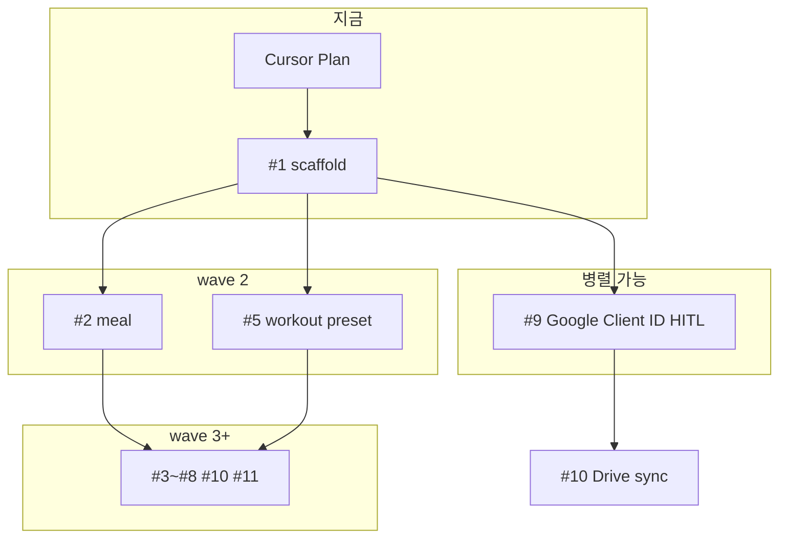

# restTime v1 — Cursor 구현 계획

## 전체로 잡아도 되나?

**계획 문서로 v1 전체(#1~#11)를 적는 것 — OK.** 오류나지 않음.

**한 번에 전부 구현하는 것 — 비추천.** greenfield + 11 slice + Google OAuth + SQLite WASM은 한 세션에서 끝내면:
- AC 검증 누락
- 컨텍스트/ diff 과대
- blocked_by 순서 무시로 integration 깨짐

**권장 실행 방식:** [TRIAGE.md](TRIAGE.md) 순서대로 **이슈 1개 완료 → AC 체크 → 다음 이슈**. 각 slice spec은 [.issues/](.issues/) Agent Brief가 contract.



---

## 참고 문서 (canonical)

| 문서 | 용도 |
|---|---|
| [PRD.md](PRD.md) | 도메인 규칙, 스키마, UI 목록 |
| [TRIAGE.md](TRIAGE.md) | 지금 할 일 / blocked |
| [.issues/001-app-scaffold.md](.issues/001-app-scaffold.md) | **첫 구현 contract** |

---

## v1 로드맵 (실행 순서)

| Phase | Issue | 산출물 | Blocked by |
|---|---|---|---|
| **1** | [#1](.issues/001-app-scaffold.md) | Vite+Vue PWA, LocalDatabase, schema, 라우터 골격 | — |
| **1b** | [#9](.issues/009-google-client-id.md) | Client ID, `docs/google-setup.md` | — (사람) |
| **2a** | [#2](.issues/002-meal-logging.md) | 오늘 식단 CRUD + 합계 | #1 |
| **2b** | [#5](.issues/005-workout-presets.md) | 요일별 운동 프리셋 | #1 |
| **3a** | [#3](.issues/003-meal-presets.md) | 식단 프리셋 | #2 |
| **3b** | [#4](.issues/004-inbody-deficit.md) | 인바디 + 적자 + 단백질 | #2 |
| **3c** | [#6](.issues/006-workout-sessions.md) | 운동 세션 | #5 |
| **4** | [#7](.issues/007-weekly-view.md) | 주간 월~일 뷰 | #2,#4,#6 |
| **5** | [#8](.issues/008-gpt-export.md) | GPT Markdown 복사 | #7 |
| **6** | [#10](.issues/010-google-drive-sync.md) | 로그인 + Drive sync | #1,#9 |
| **7** | [#11](.issues/011-pwa-deploy.md) | PWA polish + HTTPS 배포 | #1 (#8 후 권장) |

---

## Phase 1 상세: Issue #1 App scaffold

### 목표

`npm run dev`로 실행되는 Vue 3 PWA. 앱 부팅 시 SQLite 초기화, PRD 전체 테이블 생성, 새로고침 후 persistence, `exportBlob`/`importBlob` 동작, 빈 Today/Week/Settings 화면.

### 프로젝트 구조 (신규 생성)

```
restTime/
├── package.json
├── vite.config.ts          # PWA plugin, COOP/COEP if wa-sqlite needs
├── index.html
├── public/
│   └── icons/              # PWA placeholder
├── src/
│   ├── main.ts
│   ├── App.vue             # Element Plus layout + bottom/top nav
│   ├── router/index.ts
│   ├── views/
│   │   ├── TodayView.vue   # placeholder
│   │   ├── WeekView.vue
│   │   └── SettingsView.vue
│   ├── db/
│   │   ├── LocalDatabase.ts
│   │   ├── migrations.ts
│   │   └── schema.sql      # v1 full schema
│   ├── types/domain.ts     # MealType, Weekday 등
│   └── composables/useDatabase.ts
├── .env.example
├── .gitignore
└── README.md               # dev 실행법
```

백엔드 폴더 **없음** (v1).

### 기술 선택 (#1에서 확정)

- **Vue 3 + Vite + TypeScript**
- **Element Plus** — 모바일/PC 공통 UI ([PRD.md](PRD.md) 스택)
- **vite-plugin-pwa** — manifest + service worker (캐시만, DB는 OPFS)
- **@sqlite.org/sqlite-wasm** 또는 **wa-sqlite** — 브라우저 SQLite
- **Persistence:** OPFS VFS 우선 (exportBlob에 유리); fallback IndexedDB

### LocalDatabase 인터페이스

```typescript
// 개념 contract — PRD Implementation Decisions
interface LocalDatabase {
  init(): Promise<void>
  exec(sql: string, params?: unknown[]): Promise<void>
  query<T>(sql: string, params?: unknown[]): Promise<T[]>
  exportBlob(): Promise<Uint8Array>
  importBlob(data: Uint8Array): Promise<void>
}
```

- `main.ts`: `await db.init()` 후 `createApp` mount (DB ready 전 UI block 또는 loading)
- Settings 화면 임시: export/import 테스트 버튼 (AC 검증용, #10 전 debug)

### Schema migration (001_initial)

[PRD.md](PRD.md) 스키마 그대로 SQL화:

- `meal_entries` — date, sort_order, meal_type CHECK, memo, kcal, protein_g
- `meal_presets` — meal_type CHECK (no snack)
- `workout_sessions` — preset_id FK nullable
- `workout_presets` — weekday UNIQUE (v1: 1 per day)
- `workout_preset_items`
- `inbody_logs`
- `settings` — key/value; seed `protein_factor=1.7`

`schema_version` 테이블로 migration idempotent.

### 라우터 골격

| Path | View | 비고 |
|---|---|---|
| `/` | redirect → `/today` | |
| `/today` | TodayView | #2~#6에서 채움 |
| `/week` | WeekView | #7 |
| `/settings` | SettingsView | #10 |

추후 `/meal-presets`, `/workout-presets`, `/gpt` 추가 (#3,#5,#8).

### App shell UX

- Element Plus `el-container` + 모바일 **bottom tab** (오늘/주간/설정)
- `viewport` meta, safe-area padding (PWA 대비)
- 한국어 UI 라벨 (오늘, 주간, 설정)

### Issue #1 Acceptance criteria (완료 정의)

- [ ] `npm run dev` — localhost 실행
- [ ] PWA manifest + SW 등록 (dev에서 manifest 확인)
- [ ] 7 tables + settings seed migration
- [ ] 새로고침 후 DB 유지
- [ ] exportBlob → importBlob round-trip (Settings debug 버튼)
- [ ] Today/Week/Settings placeholder + nav

### Issue #1 Out of scope

- 식단/운동/인바디 비즈니스 UI (#2~#8)
- Google OAuth (#9~#10)
- production deploy (#11)
- Vitest (v1 테스트 보류 — [PRD.md](PRD.md))

---

## Phase 1b: Issue #9 (사람, 코드와 병렬)

- [Google Cloud Console](https://console.cloud.google.com) → Drive API + OAuth Client ID
- `VITE_GOOGLE_CLIENT_ID` → `.env` (gitignore)
- `docs/google-setup.md` + `.env.example`
- 상세: [.issues/009-google-client-id.md](.issues/009-google-client-id.md)

---

## 이후 Phase 공통 규칙 (에이전트용)

1. **한 이슈 = 한 PR/커밋 단위** 권장
2. **서비스 레이어** 먼저 (MealLogService 등) → Vue view 연결 — [PRD.md](PRD.md) deep modules
3. **도메인 용어:** BMR/TDEE UI 금지 → 「먹은 칼로리」「하루 소모 칼로리」「적자칼로리」
4. **주간:** 월~일, ISO week 아님
5. slice 완료 시 `.issues/NNN-*.md` frontmatter `state: done` + [TRIAGE.md](TRIAGE.md) 갱신

---

## 리스크 (#1에서 미리)

| 리스크 | 완화 |
|---|---|
| SQLite WASM + Vite COOP/COEP | vite headers 설정; sql.js fallback |
| OPFS Safari | IndexedDB VFS fallback path |
| empty repo git init | #1에 `.gitignore` (node_modules, .env) 포함 |

---

## Cursor에서 시작하는 방법

1. 이 Plan 승인
2. Agent에게: **「.issues/001-app-scaffold.md Agent Brief대로 #1 구현」**
3. AC 전부 체크 후 #2 또는 #5 진행
