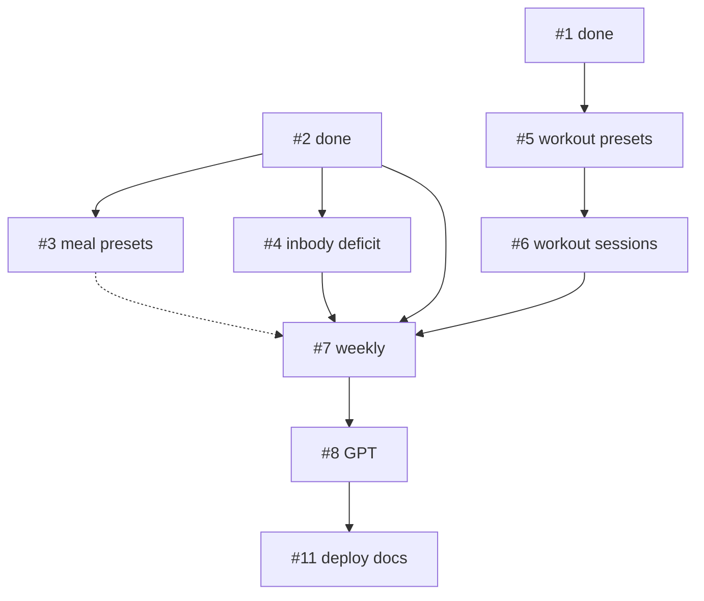

# restTime v1 나머지 전부 구현 계획

## 현재 상태

| 완료 | 산출물 |
|------|--------|
| [#1](.issues/001-app-scaffold.md) | Vue PWA, LocalDatabase, schema, 라우터 골격 |
| [#2](.issues/002-meal-logging.md) | Today 식단 CRUD + 일 합계 |
| [#10](.issues/010-google-drive-sync.md) | GIS + Drive pull/push, 단백질 계수(설정) |

**스키마:** [src/db/schema.sql](src/db/schema.sql) — `meal_presets`, `workout_*`, `inbody_logs` 테이블 **이미 존재**. DDL 추가 불필요, **서비스·UI만 구현**.

---

## 잠금 결정 (에이전트 임의 선택 금지)

| # | 항목 | 결정 |
|---|------|------|
| 1 | **네비** | 하단 탭 3개(오늘/주간/설정) **유지**. **#3 착수 시** [SettingsView.vue](src/views/SettingsView.vue)에 **「기능」카드** 골격 + `/meal-presets` 링크 추가 → 이후 이슈마다 라우트·링크 **1줄씩 추가** (`/workout-presets`, `/inbody`, `/gpt`) |
| 2 | **요일 인덱스** | PRD `weekday 0=월 … 6=일`. **#5 시작 시** [src/utils/weekday.ts](src/utils/weekday.ts) 생성 — `dateToWeekday()` / `isoDateToWeekday()` **만** 사용 (#3·#4는 불필요) |
| 3 | **운동 프리셋 중복** | 같은 weekday 저장 시 `ElMessageBox.confirm` → 기존 preset + items **DELETE 후** 새 preset INSERT |
| 4 | **인바디 N회 평균** | `N = 5` (주간·GPT 공통) |
| 5 | **단백질 목표** | `InBodyService.getLatest().weight_kg × settings.protein_factor` (인바디 없으면 「목표 미설정」) |
| 6 | **Today 레이아웃** | **단계적 적용** (한 번에 4패널 collapse 강제 X): #4 → `TodaySummaryCard` 상단 추가 · #5 → 운동 프리셋 섹션 · #6 → `el-collapse` 4패널(요약/프리셋/세션/식단) + `components/today/*` 분리. sticky 하단 = **식단 kcal·단백질 합계** 유지 |
| 7 | **운동 프리셋 Today** | v1 **읽기 전용** 체크리스트 (토글·완료 저장 **없음** — [.issues/005](.issues/005-workout-presets.md) Out of scope) |
| 8 | **GPT 출력** | 질문·코칭 문구 **금지**. ✅/❌는 **단백질·적자만** (칼로리 상한 ✅/❌ **없음**). `formatDay`에 **끼니별** memo·kcal·protein_g 포함 |
| 9 | **#11 AFK vs HITL** | AFK: `npm run build`, PWA manifest/SW 점검, 반응형 스모크, README·[docs/google-setup.md](docs/google-setup.md) prod origin **체크리스트**. HITL: 실제 Cloudflare Pages deploy URL, Console OAuth origin 등록 |

---

## 의존성·실행 순서



| Wave | 이슈 | 병렬 | 선행 |
|------|------|------|------|
| 1 | #3, #4, #5 | #3·#4·#5 동시 가능 | #2 / #1 |
| 2 | #6 | — | #5 |
| 3 | #7 | — | #2,#4,#6 |
| 4 | #8 | — | #7 |
| 5 | #11 | — | #8 권장 |

**한 방 실행 권장:** Wave 1은 **이슈 3개를 순차 완료**(각각 AC 체크) 후 Wave 2로. Wave 1을 하나의 todo에 묶지 말 것.

---

## 공통 파일·규칙

### 신규 디렉터리 (예상)

```
src/
├── domain/           # 순수 함수 (calculators, formatter 일부)
├── utils/weekday.ts  # 요일 변환 (Wave 1c 전에 생성)
├── services/         # *Service 클래스
├── views/            # *View.vue
└── components/today/ # Today 섹션 컴ponent (Wave 2 이후 Today 리팩터)
```

### 완료 Definition of Done (매 이슈)

1. 해당 [.issues/NNN-*.md](.issues/) frontmatter `state: done` + AC `[x]`
2. [TRIAGE.md](TRIAGE.md) Done 표 갱신
3. `npm run typecheck` 통과
4. (선택) [e2e/issue1-ac.spec.ts](e2e/issue1-ac.spec.ts) — 탭 라벨·URL 변경 시 **깨지면 수정** (하단 3탭 유지 전제)

### 도메인 용어 (UI 라벨)

- 사용: 「먹은 칼로리」「하루 소모 칼로리」「적자칼로리」
- 금지: BMR, TDEE

---

## Issue #3 — 식단 프리셋

**Contract:** [.issues/003-meal-presets.md](.issues/003-meal-presets.md)

| 산출물 | 내용 |
|--------|------|
| `MealPresetService` | `listByMealType()`, create/update/delete; `meal_type` snack **거부** |
| `MealLogService.applyPreset(presetId, date)` | preset → `meal_entries` 1행. **memo 잠금:** `memo = preset.memo.trim() ? \`${preset.name}: ${preset.memo}\` : preset.name` · kcal/protein_g는 preset 값 복사 · meal_type은 preset과 동일 |
| `MealPresetsView.vue` | `/meal-presets` — 탭/accordion 아침·점심·저녁; 필드: **name**, memo, kcal, protein_g |
| Today | 「프리셋 적용」드롭다운 — 타입별 preset 목록 → apply → 편집 가능 |

**AC:** CRUD, snack preset 거부, apply→entry, 관리 UI, 새로고침 유지

---

## Issue #4 — 인바디 + 적자 + 단백질

**Contract:** [.issues/004-inbody-deficit.md](.issues/004-inbody-deficit.md)

| 산출물 | 내용 |
|--------|------|
| `ProteinTargetCalculator` | `dailyProteinTargetKg(weight, factor)`, `proteinTargetMet(actual, target)` |
| `DeficitCalculator` | `dailyDeficit(burn, intake)` → `{ ok, deficit }` \| `{ ok:false, reason:'burn_unset' }` |
| `InBodyService` | CRUD + `getLatest()` + `getRecentWithAverage(5)` |
| `SettingsService` | 저장 시 `latest_burn_kcal` = log.burn_kcal; `syncBurnFromLatestInBody()` (최신 log 기준 재동기 optional) |
| `InBodyView.vue` | `/inbody` — 입력 폼 + 이력 테이블 |
| `TodaySummaryCard.vue` | **소모·적자·단백 목표 vs 실제(✅/❌)** 중심. 「먹은 kcal」은 sticky와 겹쳐도 OK(요약에 한 줄 포함 가능). **인바디 빠른입력:** PRD UI용 — 카드에 「인바디 기록」→ `/inbody` 링크로 충족(v1 전용 폼 Today 중복 **안 함**) |

**AC:** inbody CRUD, burn sync, 소모 미설정 시 적자 안내, protein_factor 연동

---

## Issue #5 — 운동 프리셋

**Contract:** [.issues/005-workout-presets.md](.issues/005-workout-presets.md)

| 산출물 | 내용 |
|--------|------|
| `WorkoutPresetService` | `getForWeekday(w)`, preset+items CRUD, sort_order, weekday UNIQUE |
| `WorkoutPresetsView.vue` | `/workout-presets` — 요일 선택(월~일), preset name, 종목 리스트 |
| Today | `TodayWorkoutPresetSection` — 오늘 weekday preset + items **읽기 전용** |

**AC:** weekday당 1, items sort_order, Today 표시

---

## Issue #6 — 운동 세션

**Contract:** [.issues/006-workout-sessions.md](.issues/006-workout-sessions.md)

| 산출물 | 내용 |
|--------|------|
| `WorkoutService` | add/update/delete, `listByDate`, `countWeeklySessions(weekRange)` |
| `TodayWorkoutSessionsSection` | name + minutes; preset_id optional (select today preset or null) |

**AC:** CRUD, nullable preset_id, 하루 N세션

---

## Issue #7 — 주간 뷰

**Contract:** [.issues/007-weekly-view.md](.issues/007-weekly-view.md)

| 산출물 | 내용 |
|--------|------|
| `WeeklySummaryAggregator` | `getWeekRange(anchor)` Mon–Sun local ([src/utils/weekRange.ts](src/utils/weekRange.ts) 공유 권장); `aggregateMeals`, `aggregateDeficits`, session count |
| [WeekView.vue](src/views/WeekView.vue) | 7행 표(kcal, protein, deficit, sessions); 주 prev/next; 일평균; 단백 평균 vs target; 인바디 recent + 5회 평균 |

**AC:** Mon–Sun 경계, 7일 집계, 운동 횟수, 인바디 블록, 칼로리 상한 ✅/❌ **없음**

---

## Issue #8 — GPT Markdown 복사

**Contract:** [.issues/008-gpt-export.md](.issues/008-gpt-export.md)

| 산출물 | 내용 |
|--------|------|
| `GptExportFormatter` | `formatDay(date)`, `formatWeek(range)`, `formatRange(from,to)` |
| `GptExportView.vue` | `/gpt` — 라디오: 오늘 / 이번 주 / 기간(date range); textarea 미리보기; 「복사」 |

**출력 섹션 (주간·기간):** PRD snippet 준수 — `# 식단` 표, `# 운동`, `# 인바디`, `# 일별 적자`, 이번 주 N회

**formatDay 최소 포함:** 날짜, 끼니별 memo/kcal/protein, 합계, 운동 세션, 적자·단백(✅/❌), 최근 인바디 1줄(있으면)

**formatRange(from,to):** inclusive 날짜 루프 — 각 일 `formatDay` 블록 연결 + 기간 합계(총 kcal·단백·운동 횟수) 마지막 절

**클립보드:** `navigator.clipboard.writeText` + `document.execCommand('copy')` 폴백

---

## Issue #11 — PWA·배포

**Contract:** [.issues/011-pwa-deploy.md](.issues/011-pwa-deploy.md)

| AFK | HITL |
|-----|------|
| [vite.config.ts](vite.config.ts) manifest/icons | Cloudflare Pages **실제 deploy** |
| Week/GPT 가로 스크롤·터치 44px 스모크 | Console **prod origin** 등록 |
| README: `npm run build`, `npm run preview`, 배포 절 | 사용자가 URL 확정 후 docs 갱신 |

---

## 라우터 추가 목록

| Path | View | 노출 |
|------|------|------|
| `/meal-presets` | MealPresetsView | 설정 「기능」 |
| `/workout-presets` | WorkoutPresetsView | 설정 「기능」 |
| `/inbody` | InBodyView | 설정 「기능」 |
| `/gpt` | GptExportView | 설정 「기능」 |

[src/router/index.ts](src/router/index.ts) lazy import 권장.

---

## 리스크·완화

| 리스크 | 완화 |
|--------|------|
| TodayView 비대 | Wave 2부터 `components/today/*` 분리 |
| 요일 off-by-one | `weekday.ts` 단일 진입점 + 주간·프리셋 동일 import |
| Wave 1 병렬 merge conflict | 이슈별 브랜치/커밋 또는 순차 #3→#4→#5 |
| E2E 깨짐 | Today placeholder 문구 변경 시 spec 업데이트 |

---

## 점검 체크리스트 (실행 전·후)

- [ ] 잠금 결정 9항 위반 없음
- [ ] 이슈 Agent Brief AC 전부 `[x]`
- [ ] `npm run typecheck` · (선택) `npm run test:e2e`
- [ ] #11: **production URL·OAuth origin** 은 사용자 HITL — AFK done 과 구분

## 선행 완료 (별도 todo 불필요)

- [#9](.issues/009-google-client-id.md) Google Client ID — 사용자 Console 작업 (Drive #10 이미 동작 중이면 충족)

---

## Wave 1 완료 (2026-05-23)

- #3 `#/meal-presets`, `MealPresetService`, Today 프리셋 적용
- #4 `#/inbody`, `TodaySummaryCard`, calculators
- #5 `#/workout-presets`, `weekday.ts`, Today 운동 체크리스트

## Wave 2 완료

- #6 `WorkoutService`, `TodayWorkoutSessionsSection` (프리셋 연결 optional)

---

## 에이전트 실행 프롬프트 (복붙용)

> 「[.cursor/plans/resttime_v1_완료_438c920a.plan.md](.cursor/plans/resttime_v1_완료_438c920a.plan.md) 잠금 결정·Wave 순서대로, 다음 pending 이슈 1개만 [.issues/](.issues/) Agent Brief AC 전부 체크 후 done 처리」
