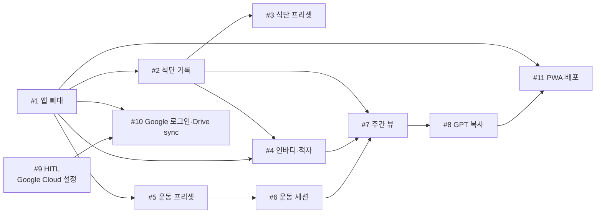

# restTime v1 — Vertical Slice Issues

> **Triage 보드:** [TRIAGE.md](./TRIAGE.md)  
> **개별 이슈:** [.issues/](./.issues/) (category + state + Agent Brief)  
> Parent: [PRD.md](./PRD.md)  
> 생성일: 2026-05-23

---

> 이 파일은 초기 vertical slice **통합본**입니다.  
> 이슈 관리·상태는 **TRIAGE.md** 와 **.issues/** 를 canonical source로 사용하세요.

---

## 용어 설명

### Blocked by (선행 작업)

**「이 슬라이스를 시작하기 전에, 먼저 완료해야 하는 다른 슬라이스」** 를 뜻합니다.

예: **#8 GPT 복사**는 주간 데이터가 필요하므로 **#7 주간 뷰**가 끝나야 합니다.  
반면 **#2 식단 기록**은 **#1 앱 뼈대**만 있으면 바로 시작할 수 있습니다 → `Blocked by: #1`

의존 관계는 **코드가 깨지지 않게 순서를 정한 것**이지, “PC는 저녁에만” 같은 사용 규칙이 아닙니다.

### HITL vs AFK

| 타입 | 의미 | 예 |
|---|---|---|
| **HITL** | Human In The Loop — **사람이 직접** 해야 하는 작업 (코드만으로 불가) | Google Cloud Console에서 OAuth 클라이언트 ID 만들기 |
| **AFK** | Away From Keyboard — **에이전트/개발자가 코드로** 구현·머지 가능 | Vue 화면, SQLite, 「Drive 저장」 버튼 |

**#9 HITL** = **개발 단계에서 1회만** (~15분). Google Cloud에서 Client ID 발급. **사용할 때는 이 설정 안 함.**

**#10 AFK** = 앱에 「Google 로그인」 버튼 + Drive 불러오기/저장. #9 Client ID를 `.env`에 넣어 두면, **이후 사용은 로그인만** 하면 Drive 연결됨.

---

## Issue #1 — App scaffold + SQLite foundation

**Type:** AFK  
**Blocked by:** None — can start immediately  
**User stories:** 6, 49

### What to build

Vue 3 + Vite + Element Plus + TypeScript PWA 뼈대를 세우고, 브라우저 SQLite(LocalDatabase)를 초기화한다. v1 전체 테이블 스키마 마이그레이션을 적용하고, `exportBlob()` / `importBlob()` 으로 DB 파일 덤프·복원이 가능해야 한다. 하단 또는 상단 네비게이션으로 빈 화면(오늘/주간/설정 등) 라우팅만 연결한다.

### Acceptance criteria

- [ ] `npm run dev` 로 앱 실행, PWA manifest 기본 설정
- [ ] SQLite WASM 초기화 및 schema migration (meal, workout, inbody, settings 테이블)
- [ ] 페이지 새로고침 후에도 로컬 DB 데이터 유지 (OPFS/IndexedDB)
- [ ] `exportBlob()` / `importBlob()` 동작 확인 (콘솔 또는 임시 버튼)
- [ ] 빈 「오늘」 화면 + 라우터 골격

---

## Issue #2 — 오늘 식단 기록 (끼니 동적 추가)

**Type:** AFK  
**Blocked by:** #1  
**User stories:** 7, 8, 9, 10, 11, 16

### What to build

「오늘」 화면에서 식단을 **순서 있는 목록**으로 CRUD한다. `+ 끼니 추가` 시 아침/점심/저녁/간식 타입 선택, 각 항목에 메모·kcal·단백질(g) 입력. 같은 타입(간식) 여러 번 추가 가능. 하단에 **오늘 총 kcal / 총 단백질** 자동 합산 표시.

### Acceptance criteria

- [ ] 끼니 추가·수정·삭제·순서(sort_order) 유지
- [ ] meal_type: breakfast | lunch | dinner | snack
- [ ] 일별 kcal·protein_g 합계 정확
- [ ] 간식 포함 하루 여러 항목 기록 가능
- [ ] 새로고침 후 데이터 유지

---

## Issue #3 — 식단 프리셋 (아침/점심/저녁)

**Type:** AFK  
**Blocked by:** #2  
**User stories:** 12, 13, 14, 15, 46

### What to build

아침/점심/저녁용 식단 프리셋 CRUD 화면. 프리셋은 name, memo, kcal, protein_g 저장. **간식 프리셋 불가.** 오늘 식단에서 「프리셋 적용」 시 타입별 목록 표시 → 선택하면 새 끼니 항목 자동 채움 → 적용 후 수정 가능.

### Acceptance criteria

- [ ] 프리셋 생성·수정·삭제
- [ ] meal_type별 프리셋 필터 (snack preset 거부)
- [ ] 프리셋 적용 → meal_entries 생성, 값 편집 가능
- [ ] 프리셋 관리 전용 라우트 또는 drawer

---

## Issue #4 — 인바디 기록 + 적자칼로리 + 단백질 목표 (오늘 요약)

**Type:** AFK  
**Blocked by:** #2  
**User stories:** 23, 24, 25, 26, 27, 28, 29, 43 (부분)

### What to build

인바디 입력: 체중, 골격근량, 체지방률, **하루 소모 칼로리**, note(선택). 저장 시 `settings.latest_burn_kcal` 자동 갱신. 오늘 화면 요약 카드:

- **먹은 칼로리** (식단 합계)
- **하루 소모 칼로리** (settings, 없으면 「미설정」)
- **적자칼로리** = 소모 − 섭취
- **단백질** 실제 vs 목표 (최근 인바디 체중 × protein_factor, 기본 1.7)

UI에 BMR/TDEE 용어 **사용 금지**.

### Acceptance criteria

- [ ] inbody_logs CRUD + 이력 목록
- [ ] 인바디 저장 → latest_burn_kcal 갱신
- [ ] 인바디 없을 때 적자 「소모 미설정」 처리
- [ ] 단백질 목표 = 최 recent weight_kg × factor
- [ ] settings.protein_factor 기본 1.7

---

## Issue #5 — 운동 프리셋 (요일별 루틴 + 종목)

**Type:** AFK  
**Blocked by:** #1  
**User stories:** 20, 21, 22, 47, 48

### What to build

요일(월~일)별 운동 프리셋 1개씩 매핑. 프리셋에 종목 리스트(순서, exercise_name, sets, reps, weight_kg 선택). 「오늘」 화면에 **오늘 요일 프리셋** 체크리스트 표시 (운동 전 참고용).

### Acceptance criteria

- [ ] workout_presets + workout_preset_items CRUD
- [ ] weekday당 프리셋 1개 (v1)
- [ ] 종목 sort_order 관리
- [ ] 오늘 요일 프리셋 홈 표시

---

## Issue #6 — 운동 세션 기록

**Type:** AFK  
**Blocked by:** #5 (프리셋 연결 UX), #1 (최소)  
**User stories:** 17, 18, 19, 35 (부분)

### What to build

운동 세션: name + minutes + date. 선택적으로 workout_preset 연결 (예: `Push Day · 45분`). 프리셋 없이 자유 텍스트 세션도 가능. 하루 여러 세션. 오늘 화면에 세션 목록.

### Acceptance criteria

- [ ] workout_sessions CRUD
- [ ] preset_id nullable, name+minutes 필수
- [ ] 하루 N개 세션
- [ ] 오늘 화면 세션 목록

---

## Issue #7 — 주간 뷰 (월~일)

**Type:** AFK  
**Blocked by:** #2, #4, #6  
**User stories:** 30, 31, 32, 33, 34, 35, 36, 37, 51 (부분)

### What to build

**월요일~일요일** 주간 화면. 요일별 총 kcal·단백질 표, **주간 일평균** kcal·단백질. 단백질 일평균 vs 목표(체중×1.7) 비교. 칼로리 상한 ✅/❌ **없음** (숫자만). 이번 주 운동 세션 **횟수**. 요일별 적자칼로리. 인바디 최근 기록 + N회 평균(체지방 등).

### Acceptance criteria

- [ ] getWeekRange: 월 00:00 ~ 일 23:59 (로컬 TZ)
- [ ] 7일 식단 집계 표 + 일평균
- [ ] 주간 운동 횟수 = 세션 count
- [ ] 요일별 적자 (소모 미설정 날 처리)
- [ ] 인바디 recent + average 블록

---

## Issue #8 — GPT Markdown 복사 (숫자만)

**Type:** AFK  
**Blocked by:** #4, #6, #7 (주간 export); 오늘-only는 #2+#4+#6 후 부분 가능  
**User stories:** 38, 39, 40, 41, 42

### What to build

GPT용 Markdown 생성: **오늘 / 이번 주(월~일) / 기간 선택** 프리셋. 미리보기 + 「GPT용 복사」→ 클립보드. **질문·코칭 문구 포함 금지.** 포함: 끼니별 식단, 총 kcal/단백질, 운동, 인바디 추이, 일별/주간 적자, 주간 평균.

### Acceptance criteria

- [ ] formatDay / formatWeek / formatRange
- [ ] 출력에 사용자 질문 슬롯 없음
- [ ] 클립보드 복사 (모바일·PC)
- [ ] PRD 스니ippet 형식 준수

---

## Issue #9 — [HITL] Google Client ID 1회 발급 (~15분, 이후 사용은 로그인만)

**Type:** HITL  
**Blocked by:** None — can start immediately (코드 작업과 병렬 가능)  
**User stories:** 1, 44 (인프라)

> **한 줄 요약:** 개발할 때 **한 번만** Google Console에서 Client ID 받아 두면, 배포 후 **매일 쓸 때는 앱에서 로그인 버튼만** 누르면 Drive 연결됨.

### What to build

**코드가 아닌, 개발자 1회 작업.** Google Cloud Console에서:

1. 프로젝트 생성
2. Google Drive API 활성화
3. OAuth consent screen (External / Testing)
4. OAuth 2.0 Client ID (Web application) — authorized JavaScript origins, redirect URIs
5. Client ID를 팀에 전달 (`.env.example` 항목 문서화)

앱 scope: Drive file access (appDataFolder 또는 특정 folder — #10 구현 시 확정)

### Acceptance criteria

- [ ] Drive API enabled
- [ ] OAuth Client ID 발급
- [ ] README 또는 `docs/google-setup.md`에 설정 절차·origin 목록
- [ ] `.env.example` with `VITE_GOOGLE_CLIENT_ID`

---

## Issue #10 — Google 로그인 + Drive 불러오기/저장하기

**Type:** AFK  
**Blocked by:** #1, #9  
**User stories:** 1, 2, 3, 4, 5, 43, 44, 45

### What to build

Google Identity Services로 로그인/로그아웃. 설정 화면:

- **Drive에서 불러오기** → remote DB download → `importBlob()`
- **Drive에 저장하기** → `exportBlob()` → upload
- remote가 더 새면 저장 전 **경고** (`checkRemoteNewer`)
- 단백질 계수(protein_factor) 설정
- 오프라인: 로컬 DB 기록 가능, sync는 온라인+버튼

백업 경로: `restTime/health.db` (고정)

### Acceptance criteria

- [ ] Google sign-in/out
- [ ] pull / push 수동 버튼
- [ ] remote newer 경고 UX
- [ ] protein_factor 설정 저장
- [ ] #9 Client ID로 로컬/dev 동작

---

## Issue #11 — PWA polish + 반응형 + 정적 배포

**Type:** AFK  
**Blocked by:** #1; 완성도는 #8 이후 권장  
**User stories:** 49, 50, 51, 45 (부분)

### What to build

PWA installable (icons, service worker). 모바일: 한 손 입력·큰 터치 타겟. PC: 주간 표·GPT 미리보기 넓은 레이아웃. 정적 호스팅 배포 (Cloudflare Pages 등) + HTTPS (OAuth 필수).

### Acceptance criteria

- [ ] 홈 화면 추가 / install prompt
- [ ] 모바일·데스크톱 responsive smoke test
- [ ] production build deploy URL
- [ ] OAuth authorized origin에 deploy URL 등록 (#9 업데이트)

---

## 구현 순서 권장 (AFK)

| 순서 | Issue | 병렬 가능 |
|---|---|---|
| 1 | #1 | — |
| 2 | #9 (HITL, 사람) | #1과 병렬 |
| 3 | #2, #5 | 병렬 |
| 4 | #3, #4, #6 | #3←#2, #4←#2, #6←#5 |
| 5 | #7 | |
| 6 | #8 | |
| 7 | #10 | #9 완료 후 |
| 8 | #11 | |

---

## Parent PRD User Story → Issue 매핑

| Stories | Issues |
|---|---|
| 1–6 | #9, #10, #1 |
| 7–16 | #2, #3 |
| 17–22 | #5, #6 |
| 23–29 | #4 |
| 30–37 | #7 |
| 38–42 | #8 |
| 43–45 | #4, #10 |
| 46–48 | #3, #5 |
| 49–51 | #1, #11 |
