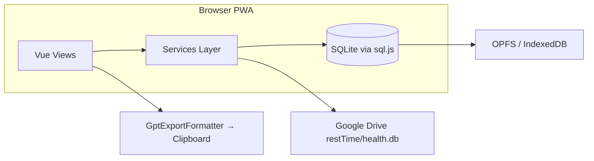

# restTime

**식단 · 운동 · 인바디를 기록하고, 주간 실행을 확인하고, ChatGPT에 붙여넣을 Markdown을 한 번에 복사하는 개인용 PWA**

백엔드 없이 브라우저에서 동작합니다. 데이터는 기기 로컬 SQLite에 저장되고, 선택적으로 Google Drive에 백업할 수 있습니다.

---

## 왜 restTime인가

매일 같은 식단·운동을 반복 입력하는 부담, BMR/TDEE 같은 전문 용어, ChatGPT에 넘기려면 매번 숫자를 정리해야 하는 불편함 — restTime은 **「이번 주 잘 지켰는지」**에 초점을 맞춘 개인 기록 앱입니다.

| 문제 | restTime의 접근 |
|------|-----------------|
| 반복 입력 | 식단·운동 **프리셋**으로 한 번에 채우기 |
| 목표가 추상적 | **월~일** 칼로리·단백질·운동 횟수·적자칼로리 |
| GPT 피드백 준비 | **숫자·기록만** 담긴 Markdown 복사 (질문 문구 없음) |
| 기기 간 이동 | Google Drive **수동** pull/push (`restTime/health.db`) |
| 인바디 해석 | 최근값 + **5회 평균**, 소모 칼로리 → 적자 자동 반영 |

---

## 주요 기능

### 오늘 (`/today`)
- 끼니별 식단 CRUD (아침/점심/저녁/간식, 순서 변경)
- 식단 프리셋 적용, 일별 kcal·단백질 합계
- 운동 세션 기록 (프리셋 연결 또는 자유 입력)
- 오늘 요일 운동 프리셋 체크리스트
- 적자칼로리 · 단백질 목표 (✅/❌)

### 주간 (`/week`)
- **월요일~일요일** 요일별 kcal·단백질·적자·운동 횟수
- 일평균, 주간 운동 세션 수, 인바디 최근·평균

### GPT 복사 (`/gpt`)
- 범위: **오늘 / 이번 주 / 사용자 지정 기간**
- Markdown 미리보기 → 클립보드 복사

### 설정 (`/settings`)
- Google 로그인 · Drive 불러오기/저장하기
- 단백질 계수 (목표 = 최근 체중 × 계수, 기본 1.7)
- SQLite blob 내보내기/가져오기 (비상 백업)
- **기능** 링크: 식단 프리셋 · 인바디 · 운동 프리셋 · GPT

---

## 기술 스택

| 영역 | 기술 |
|------|------|
| UI | Vue 3, Vite 6, TypeScript, Element Plus |
| PWA | vite-plugin-pwa (Service Worker, manifest) |
| 데이터 | sql.js (WASM SQLite) |
| 영속화 | OPFS 우선 → 미지원 시 IndexedDB |
| 동기화 | Google Identity Services + Drive API v3 |
| 테스트 | Playwright (E2E) |

---

## 아키텍처



- **서버 없음**: v1은 정적 SPA만 배포합니다.
- **로컬 우선**: 오프라인 입력 가능, Drive는 사용자가 수동으로 sync합니다.

---

## 시작하기

### 요구 사항

- Node.js **18+**
- npm

### 설치 및 개발 서버

```bash
git clone https://github.com/yooyes31/restTime.git
cd restTime
npm install
npm run dev
```

브라우저에서 Vite가 출력하는 URL(기본 `http://localhost:5173`)로 접속합니다.

### Google Drive (선택)

Drive 동기화를 쓰려면 Google Cloud에서 OAuth 웹 클라이언트 ID를 발급합니다.

```bash
cp .env.example .env
# .env 에 VITE_GOOGLE_CLIENT_ID=....apps.googleusercontent.com
```

- 상세 절차: [docs/google-setup.md](./docs/google-setup.md)
- `.env`는 git에 올리지 않습니다 (`.gitignore` 처리됨)
- `.env` 변경 후 **`npm run dev` 재시작** 필요

---

## 스크립트

| 명령 | 설명 |
|------|------|
| `npm run dev` | 개발 서버 (PWA dev SW 포함) |
| `npm run build` | 타입체크 + 프로덕션 빌드 → `dist/` |
| `npm run preview` | 빌드 결과 로컬 미리보기 (PWA·라우팅 확인) |
| `npm run typecheck` | TypeScript 검사 |
| `npm run test:e2e:install` | Playwright Chromium 설치 (최초 1회) |
| `npm run test:e2e` | E2E 테스트 |

---

## PWA 설치

1. `npm run build && npm run preview` 또는 HTTPS 배포 URL 접속
2. **Android / Desktop Chrome**: 주소창 「앱 설치」 또는 「홈 화면에 추가」
3. **iOS Safari**: 공유 → 「홈 화면에 추가」

아이콘·manifest·Service Worker는 `vite-plugin-pwa`로 생성됩니다 (`public/icons/`).

---

## 배포

Cloudflare Pages 등 **정적 HTTPS** 호스트에 `dist/`를 배포합니다.

| 설정 | 값 |
|------|-----|
| Build command | `npm run build` |
| Output directory | `dist` |
| 환경 변수 | `VITE_GOOGLE_CLIENT_ID` (Drive 사용 시) |

- SPA 라우팅: `public/_redirects` (Cloudflare Pages fallback)
- 배포·OAuth origin 체크리스트: [docs/deploy.md](./docs/deploy.md)

배포 URL 확정 후 Google Console **승인된 JavaScript origin**에 `https://your-app.pages.dev` 형태로 추가해야 프로덕션에서 로그인이 동작합니다.

---

## 프로젝트 구조

```
restTime/
├── src/
│   ├── views/           # 화면 (Today, Week, Settings, …)
│   ├── components/      # Today 하위 섹션 등
│   ├── services/        # MealLog, Workout, InBody, Drive, GPT export
│   ├── domain/          # 적자·단백질 계산 (순수 함수)
│   ├── db/              # LocalDatabase, schema, migrations
│   └── utils/           # 날짜, 주간 범위(월~일), 클립보드
├── public/
│   ├── icons/           # PWA 아이콘
│   └── _redirects       # SPA fallback
├── docs/
│   ├── google-setup.md  # OAuth·Drive API 설정
│   └── deploy.md        # Cloudflare Pages 배포
├── e2e/                 # Playwright
├── PRD.md               # 제품 요구사항
└── .issues/             # 구현 이슈·AC
```

---

## 도메인 규칙 (요약)

- **주간**: 로컬 TZ 기준 **월 00:00 ~ 일 23:59** (ISO week 아님)
- **단백질 목표**: `최 recent 인바디 체중(kg) × protein_factor` (기본 1.7)
- **적자칼로리**: `하루 소모 칼로리 − 먹은 칼로리` (BMR/TDEE UI 없음)
- **GPT 출력**: 질문·코칭 문구 **미포함**, 단백질·적자에만 ✅/❌
- **Drive**: 한 번에 한 기기에서 수정 권장, 원격이 더 새로우면 push 전 경고

자세한 스펙: [PRD.md](./PRD.md)

---

## 로드맵

**v1 (현재)**: 로컬 PWA + Drive 수동 sync + GPT Markdown 복사

**v2 (계획)**: FastAPI + MariaDB + JWT 다중 사용자 (PRD 참고)

---

## 문서

| 문서 | 내용 |
|------|------|
| [PRD.md](./PRD.md) | 기능·도메인·아키텍처 |
| [docs/google-setup.md](./docs/google-setup.md) | Google OAuth / Drive API |
| [docs/deploy.md](./docs/deploy.md) | 정적 배포·PWA·prod origin |
| [TRIAGE.md](./TRIAGE.md) | 이슈 보드 |
| [.issues/](./.issues/) | 이슈별 Agent Brief |

---

## 보안·개인정보

- 건강 기록은 **브라우저 로컬 DB**에 저장됩니다.
- Drive sync 시 SQLite 파일이 **본인 Google Drive** (`restTime/health.db`)에만 업로드됩니다.
- `VITE_GOOGLE_CLIENT_ID`만 프론트에 포함되며, Client Secret은 사용하지 않습니다.

---

## 라이선스

개인 프로젝트입니다. 저장소 공개 시 라이선스 파일(`LICENSE`) 추가를 권장합니다.
